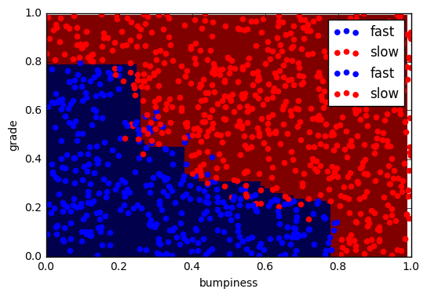
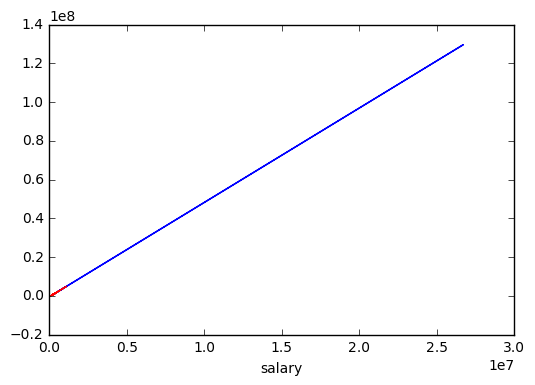
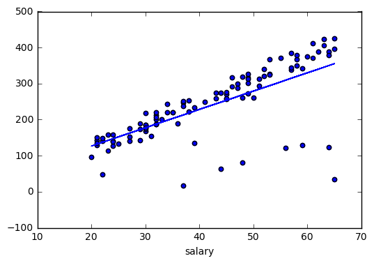
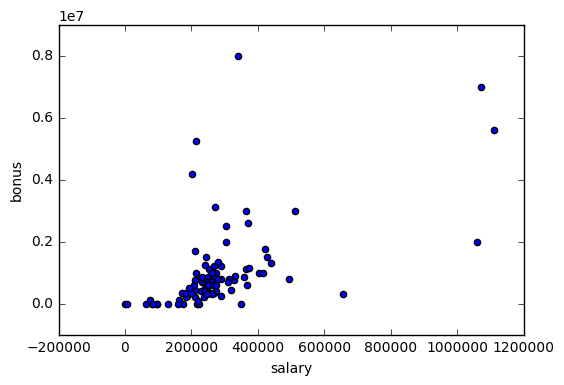
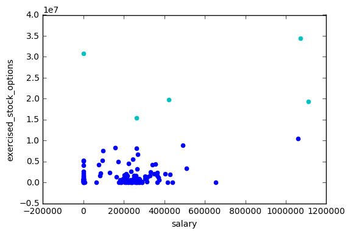
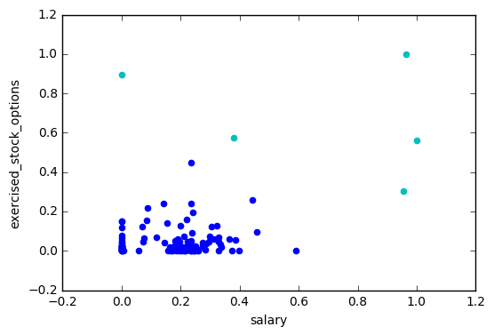

# Mini Project


```python
import sys
from time import time
sys.path.append("../tools/")
from email_preprocess import preprocess
from sklearn.metrics import accuracy_score
from sklearn.naive_bayes import GaussianNB

### features_train and features_test are the features for the training
### and testing datasets, respectively
### labels_train and labels_test are the corresponding item labels
features_train, features_test, labels_train, labels_test = preprocess()


#########################################################
### your code goes here ###
t0 = time()
clf = GaussianNB()
clf.fit(features_train, labels_train)
print "training time:", round(time()-t0, 3), "s"
pred = clf.predict(features_test)
print "predicting time:", round(time()-t0, 3), "s"
print "accuracy score:", accuracy_score(pred, labels_test)


#########################################################
```

    no. of Chris training emails: 7936
    no. of Sara training emails: 7884
    training time: 0.116 s
    predicting time: 0.142 s
    accuracy score: 0.920364050057


```python
#!/usr/bin/python

"""
    This is the code to accompany the Lesson 3 (decision tree) mini-project.

    Use a Decision Tree to identify emails from the Enron corpus by author:
    Sara has label 0
    Chris has label 1
"""

import sys
from time import time
sys.path.append("../tools/")
from email_preprocess import preprocess


### features_train and features_test are the features for the training
### and testing datasets, respectively
### labels_train and labels_test are the corresponding item labels
features_train, features_test, labels_train, labels_test = preprocess()


print len(features_train[0])


#########################################################
### your code goes here ###
from sklearn import tree
clf= tree.DecisionTreeClassifier(min_samples_split=40)
clf.fit(features_train,labels_train)
pred = clf.predict(features_test)


from sklearn.metrics import accuracy_score
acc_min_samples_split_40 =  accuracy_score(pred, labels_test)

print acc_min_samples_split_40

#########################################################
```

    no. of Chris training emails: 7936
    no. of Sara training emails: 7884
    379
    0.967007963595


## Choose my own algorithm


```python
import matplotlib.pyplot as plt
from prep_terrain_data import makeTerrainData
from class_vis import prettyPicture

features_train, labels_train, features_test, labels_test = makeTerrainData()


### the training data (features_train, labels_train) have both "fast" and "slow"
### points mixed together--separate them so we can give them different colors
### in the scatterplot and identify them visually
grade_fast = [features_train[ii][0] for ii in range(0, len(features_train)) if labels_train[ii]==0]
bumpy_fast = [features_train[ii][1] for ii in range(0, len(features_train)) if labels_train[ii]==0]
grade_slow = [features_train[ii][0] for ii in range(0, len(features_train)) if labels_train[ii]==1]
bumpy_slow = [features_train[ii][1] for ii in range(0, len(features_train)) if labels_train[ii]==1]


#### initial visualization
plt.xlim(0.0, 1.0)
plt.ylim(0.0, 1.0)
plt.scatter(bumpy_fast, grade_fast, color = "b", label="fast")
plt.scatter(grade_slow, bumpy_slow, color = "r", label="slow")
plt.legend()
plt.xlabel("bumpiness")
plt.ylabel("grade")
plt.show()
################################################################################


### your code here!  name your classifier object clf if you want the
### visualization code (prettyPicture) to show you the decision boundary

from sklearn.ensemble import AdaBoostClassifier
from sklearn.metrics import accuracy_score


from sklearn.ensemble import RandomForestClassifier

clf = RandomForestClassifier(n_estimators=300, min_samples_split=80, random_state=100)

#clf = AdaBoostClassifier(n_estimators=20, random_state=True)
clf.fit(features_train,labels_train)
pred = clf.predict(features_test)
print accuracy_score(pred, labels_test)

try:
    prettyPicture(clf, features_test, labels_test)
except NameError:
    pass

```





    0.932


```python

"""
    Starter code for exploring the Enron dataset (emails + finances);
    loads up the dataset (pickled dict of dicts).

    The dataset has the form:
    enron_data["LASTNAME FIRSTNAME MIDDLEINITIAL"] = { features_dict }

    {features_dict} is a dictionary of features associated with that person.
    You should explore features_dict as part of the mini-project,
    but here's an example to get you started:

    enron_data["SKILLING JEFFREY K"]["bonus"] = 5600000

"""

import pickle

enron_data = pickle.load(open("../final_project/final_project_dataset.pkl", "r"))

print enron_data["METTS MARK"]
```

    {'salary': 365788, 'to_messages': 807, 'deferral_payments': 'NaN', 'total_payments': 1061827, 'exercised_stock_options': 'NaN', 'bonus': 600000, 'restricted_stock': 585062, 'shared_receipt_with_poi': 702, 'restricted_stock_deferred': 'NaN', 'total_stock_value': 585062, 'expenses': 94299, 'loan_advances': 'NaN', 'from_messages': 29, 'other': 1740, 'from_this_person_to_poi': 1, 'poi': False, 'director_fees': 'NaN', 'deferred_income': 'NaN', 'long_term_incentive': 'NaN', 'email_address': 'mark.metts@enron.com', 'from_poi_to_this_person': 38}


```python
len(enron_data['METTS MARK'])

poi =[]
count = 0
for i in enron_data:
    if enron_data[i]["poi"] == True:
        count = count + 1
        poi.append(i)
        #print i

#print count
#print poi

#print enron_data


file = open("../final_project/poi_names.txt", "r")
d =[]
a = file.read().splitlines()
b = a[2:]
for i in b:
    if "(y)" in i or "(n)" in i:
        c = i.split()[1:]
        name = [c[0].split(",")[0].upper(),c[1].upper()]
        d.append(name)
#print d

n = 0
for i in poi:
    for name in d:
        if name[0] in i and name[1] in i:
            n = n + 1
            print i
print n

print len(d) + len(poi) - n    
```


```python
print enron_data[ 'LAY KENNETH L']["total_payments"]
print enron_data[ 'FASTOW ANDREW S']["total_payments"]
print enron_data[ 'SKILLING JEFFREY K']["total_payments"]
```

    103559793
    2424083
    8682716


```python
count = 0
for i in enron_data:
    if enron_data[i]["total_payments"] == "NaN" and enron_data[i]["poi"] == True:
        count = count + 1
print count
print len(enron_data)
print float(count) / len(enron_data)

print 28.0/156
```

    0
    146
    0.0
    0.179487179487


# Regression


```python
#!/usr/bin/python

"""
    Starter code for the regression mini-project.

    Loads up/formats a modified version of the dataset
    (why modified?  we've removed some trouble points
    that you'll find yourself in the outliers mini-project).

    Draws a little scatterplot of the training/testing data

    You fill in the regression code where indicated:
"""    


import sys
import pickle
sys.path.append("../tools/")
from feature_format import featureFormat, targetFeatureSplit
dictionary = pickle.load( open("../final_project/final_project_dataset.pkl", "r") )

### list the features you want to look at--first item in the
### list will be the "target" feature
features_list = ["bonus", "salary"]
data = featureFormat( dictionary, features_list, remove_any_zeroes=True)
target, features = targetFeatureSplit( data )

### training-testing split needed in regression, just like classification
from sklearn.cross_validation import train_test_split
feature_train, feature_test, target_train, target_test = train_test_split(features, target, test_size=0.5, random_state=42)
train_color = "b"
test_color = "r"


### Your regression goes here!
### Please name it reg, so that the plotting code below picks it up and

from sklearn import linear_model
reg = linear_model.LinearRegression()
#reg.fit(feature_train,target_train)  #regression of train data
reg.fit(feature_test,target_test) #regression of test data
import matplotlib.pyplot as plt
plt.xlabel(features_list[1])
#plt.scatter(feature_train, target_train, color = train_color, label="train") #draw train points
#plt.scatter(feature_test, target_test, color = test_color, label="test") #draw test points
plt.plot(feature_train, reg.predict(feature_train), color="b")
plt.plot(feature_test, reg.predict(feature_test), color="r")
plt.show()


print reg.coef_[0] #the slope of regression line
print reg.intercept_
print reg.score(feature_train,target_train)
print reg.score(feature_test,target_test)
### plots it correctly. Don't forget to change the test_color above from "b" to
### "r" to differentiate training points from test points.
```





    4.87222763654
    -552452.722012
    0.873462848869
    0.624035823887


# Outlier


```python
import random
import numpy
import matplotlib.pyplot as plt
import pickle

#from outlier_cleaner import outlierCleaner


### load up some practice data with outliers in it
ages = pickle.load( open("practice_outliers_ages.pkl", "r") )
net_worths = pickle.load( open("practice_outliers_net_worths.pkl", "r") )

### ages and net_worths need to be reshaped into 2D numpy arrays
### second argument of reshape command is a tuple of integers: (n_rows, n_columns)
### by convention, n_rows is the number of data points
### and n_columns is the number of features
ages       = numpy.reshape( numpy.array(ages), (len(ages), 1))
net_worths = numpy.reshape( numpy.array(net_worths), (len(net_worths), 1))
from sklearn.cross_validation import train_test_split
ages_train, ages_test, net_worths_train, net_worths_test = train_test_split(ages, net_worths, test_size=0.1, random_state=42)

### fill in a regression here!  Name the regression object reg so that
from sklearn import linear_model
reg = linear_model.LinearRegression()
reg.fit(ages_train,net_worths_train)
### the plotting code below works, and you can see what your regression looks like
import matplotlib.pyplot as plt
plt.xlabel(features_list[1])
plt.plot(ages_train, reg.predict(ages_train), color="b")
plt.scatter(ages_train,net_worths_train, color = train_color, label="train")
print reg.coef_[0][0]
print reg.score(ages_test,net_worths_test)

try:
    plt.plot(ages, reg.predict(ages), color="blue")
except NameError:
    pass
plt.scatter(ages, net_worths)
plt.show()


### identify and remove the most outlier-y points
cleaned_data = []
try:
    predictions = reg.predict(ages_train)
    cleaned_data = outlierCleaner( predictions, ages_train, net_worths_train )
except NameError:
    print "your regression object doesn't exist, or isn't name reg"
    print "can't make predictions to use in identifying outliers"

### only run this code if cleaned_data is returning data
if len(cleaned_data) > 0:
    ages, net_worths, errors = zip(*cleaned_data)
    ages       = numpy.reshape( numpy.array(ages), (len(ages), 1))
    net_worths = numpy.reshape( numpy.array(net_worths), (len(net_worths), 1))

    ### refit your cleaned data!
    try:
        reg.fit(ages, net_worths)
        plt.plot(ages, reg.predict(ages), color="blue")
        print reg.coef_[0][0]
        print reg.score(ages_test,net_worths_test)
    except NameError:
        print "you don't seem to have regression imported/created,"
        print "   or else your regression object isn't named reg"
        print "   either way, only draw the scatter plot of the cleaned data"
    plt.scatter(ages, net_worths)
    plt.xlabel("ages")
    plt.ylabel("net worths")
    plt.show()


else:
    print "outlierCleaner() is returning an empty list, no refitting to be done"
```

    5.07793064344
    0.878262478835





    6.36859480694
    0.983189455686


```python
def outlierCleaner(predictions, ages, net_worths):
    """
        Clean away the 10% of points that have the largest
        residual errors (difference between the prediction
        and the actual net worth).

        Return a list of tuples named cleaned_data where
        each tuple is of the form (age, net_worth, error).
    """
    errors = (net_worths - predictions)**2
    cleaned_data =zip(ages,net_worths,errors)
    cleaned_data = sorted(cleaned_data, key=lambda x: x[2],reverse=True) #按照第三个元素来排序
    cleaned_data = cleaned_data[int(len(net_worths)*0.1):]
    return cleaned_data

```

## Enron Outliers


```python
import pickle
import sys
import matplotlib.pyplot
sys.path.append("../tools/")
from feature_format import featureFormat, targetFeatureSplit


### read in data dictionary, convert to numpy array
data_dict = pickle.load( open("../final_project/final_project_dataset.pkl", "r") )
data_dict.pop("TOTAL", 0)

features = ["salary", "bonus"]
data = featureFormat(data_dict, features)


#print data_dict

### your code below
for point in data:
    salary = point[0]
    bonus = point[1]
    matplotlib.pyplot.scatter( salary, bonus )


matplotlib.pyplot.xlabel("salary")
matplotlib.pyplot.ylabel("bonus")
matplotlib.pyplot.show()


print data.max()
for i in data_dict:
    if data_dict[i]["salary"] != 'NaN' and data_dict[i]["bonus"] != 'NaN':
        if data_dict[i]["salary"] >=1000000 and data_dict[i]["bonus"] >= 5000000:
            print i
```





    8000000.0
    LAY KENNETH L
    SKILLING JEFFREY K


# K means


```python
#!/usr/bin/python

"""
    Skeleton code for k-means clustering mini-project.
"""


import pickle
import numpy
import matplotlib.pyplot as plt
import sys
sys.path.append("../tools/")
from feature_format import featureFormat, targetFeatureSplit
def Draw(pred, features, poi, mark_poi=False, name="image.png", f1_name="feature 1", f2_name="feature 2"):
    """ some plotting code designed to help you visualize your clusters """

    ### plot each cluster with a different color--add more colors for
    ### drawing more than five clusters
    colors = ["b", "c", "k", "m", "g"]
    for ii, pp in enumerate(pred):
        plt.scatter(features[ii][0], features[ii][1], color = colors[pred[ii]])

    ### if you like, place red stars over points that are POIs (just for funsies)
    if mark_poi:
        for ii, pp in enumerate(pred):
            if poi[ii]:
                plt.scatter(features[ii][0], features[ii][1], color="r", marker="*")
    plt.xlabel(f1_name)
    plt.ylabel(f2_name)
    plt.savefig(name)
    plt.show()


### load in the dict of dicts containing all the data on each person in the dataset
data_dict = pickle.load( open("../final_project/final_project_dataset.pkl", "r") )
### there's an outlier--remove it!
data_dict.pop("TOTAL", 0)


### the input features we want to use
### can be any key in the person-level dictionary (salary, director_fees, etc.)
feature_1 = "salary"
feature_2 = "exercised_stock_options"
poi  = "poi"
#feature_3 = "total_payments"
features_list = [poi, feature_1, feature_2]
#features_list = [poi, feature_1, feature_2, feature_3]
data = featureFormat(data_dict, features_list )
poi, finance_features = targetFeatureSplit( data )
print poi

print finance_features

### in the "clustering with 3 features" part of the mini-project,
### you'll want to change this line to
### for f1, f2, _ in finance_features:
### (as it's currently written, the line below assumes 2 features)
#for f1, f2,_ in finance_features:
for f1, f2 in finance_features:
    plt.scatter(f1, f2)
plt.show()


##scalling
from sklearn.preprocessing import MinMaxScaler
scaler = MinMaxScaler()
rescaled_finance_features = scaler.fit_transform(finance_features)

##scalling transform sample
financial_features_test = numpy.array([200000., 1000000.])
financial_features_test_transformed = scaler.transform(financial_features_test.reshape(1,-1))
print financial_features_test_transformed


### cluster here; create predictions of the cluster labels
### for the data and store them to a list called pred
from sklearn.cluster import KMeans
kmeans = KMeans(n_clusters=2, random_state=0).fit(rescaled_finance_features)
pred = kmeans.predict(rescaled_finance_features)

kmeans_1 = KMeans(n_clusters=2, random_state=0).fit(finance_features)
pred_1 = kmeans_1.predict(finance_features)


### rename the "name" parameter when you change the number of features
### so that the figure gets saved to a different file
try:
    Draw(pred_1, finance_features, poi, mark_poi=False, name="clusters.pdf", f1_name=feature_1, f2_name=feature_2)
    Draw(pred, rescaled_finance_features, poi, mark_poi=False, name="clusters.pdf", f1_name=feature_1, f2_name=feature_2)
except NameError:
    print "no predictions object named pred found, no clusters to plot"


a = []
for i in data_dict:
    entry = data_dict[i]["salary"]
    if entry != "NaN":
        a.append(entry)
print max(a)
print min(a)

```

    [0.0, 0.0, 0.0, 0.0, 1.0, 0.0, 0.0, 0.0, 0.0, 0.0, 0.0, 0.0, 0.0, 0.0, 0.0, 0.0, 1.0, 0.0, 0.0, 0.0, 0.0, 0.0, 0.0, 0.0, 0.0, 0.0, 0.0, 1.0, 0.0, 0.0, 0.0, 0.0, 0.0, 0.0, 1.0, 0.0, 0.0, 0.0, 0.0, 0.0, 0.0, 0.0, 0.0, 0.0, 1.0, 0.0, 0.0, 0.0, 0.0, 0.0, 1.0, 0.0, 0.0, 0.0, 1.0, 0.0, 0.0, 0.0, 0.0, 0.0, 0.0, 0.0, 0.0, 0.0, 0.0, 1.0, 0.0, 0.0, 0.0, 0.0, 0.0, 1.0, 0.0, 0.0, 1.0, 0.0, 1.0, 1.0, 0.0, 0.0, 0.0, 0.0, 1.0, 0.0, 0.0, 0.0, 0.0, 0.0, 0.0, 0.0, 0.0, 0.0, 0.0, 0.0, 0.0, 0.0, 0.0, 0.0, 0.0, 0.0, 0.0, 0.0, 0.0, 0.0, 0.0, 0.0, 1.0, 1.0, 0.0, 0.0, 0.0, 0.0, 0.0, 0.0, 0.0, 1.0, 0.0, 0.0, 0.0, 0.0, 1.0, 0.0, 0.0, 1.0]
    [array([ 365788.,       0.]), array([  267102.,  6680544.]), array([  170941.,  4890344.]), array([      0.,  651850.]), array([  243293.,  5538001.]), array([ 267093.,       0.]), array([      0.,  493489.]), array([  370448.,  1104054.]), array([       0.,  5210569.]), array([ 197091.,  880290.]), array([  130724.,  2282768.]), array([ 288589.,       0.]), array([ 248546.,  765313.]), array([ 257486.,       0.]), array([       0.,  2218275.]), array([      0.,  372205.]), array([ 288542.,       0.]), array([  251654.,  1056320.]), array([ 288558.,  185063.]), array([ 63744.,      0.]), array([       0.,  1030329.]), array([  357091.,  4346544.]), array([ 271442.,   81042.]), array([    0.,  3285.]), array([  304110.,  1441898.]), array([ 187922.,       0.]), array([  213625.,  1465734.]), array([  249201.,  1635238.]), array([     0.,  98718.]), array([ 231330.,       0.]), array([ 182245.,  601438.]), array([ 211788.,       0.]), array([      0.,  850477.]), array([      0.,  664375.]), array([ 224305.,       0.]), array([ 273746.,       0.]), array([  339288.,  4158995.]), array([  216582.,  1624396.]), array([  210500.,  2027865.]), array([ 272880.,  436515.]), array([  4.77000000e+02,   4.04615700e+06]), array([      0.,  371750.]), array([ 269076.,  607837.]), array([  428780.,  1835558.]), array([  211844.,  1624396.]), array([      0.,  412878.]), array([ 206121.,   17378.]), array([ 174246.,       0.]), array([  510364.,  3282960.]), array([  365038.,  1623010.]), array([  365163.,  2291113.]), array([  162779.,  1362375.]), array([      0.,  139130.]), array([  236457.,  2549361.]), array([  1072321.,  34348384.]), array([ 261516.,       0.]), array([  329078.,  1637034.]), array([      0.,  757301.]), array([ 184899.,       0.]), array([ 192008.,   83237.]), array([ 263413.,  506765.]), array([ 262663.,  187500.]), array([      0.,  759557.]), array([       0.,  1753766.]), array([ 374125.,  608750.]), array([ 278601.,       0.]), array([    0.,  9803.]), array([ 199157.,  664461.]), array([     0.,  59539.]), array([   96840.,  7509039.]), array([   80818.,  1599641.]), array([ 213999.,  953136.]), array([  210692.,  1451869.]), array([  222093.,  4452476.]), array([ 440698.,       0.]), array([      0.,  343434.]), array([ 240189.,       0.]), array([   420636.,  19794175.]), array([ 275101.,  850010.]), array([ 314288.,  117551.]), array([   94941.,  5266578.]), array([ 239502.,       0.]), array([  1111258.,  19250000.]), array([       0.,  1426469.]), array([      0.,  886231.]), array([ 6615.,     0.]), array([ 655037.,   28798.]), array([  404338.,  2022048.]), array([       0.,  1324578.]), array([  259996.,  1668260.]), array([  317543.,  1297049.]), array([       0.,  5127155.]), array([  201955.,  1729541.]), array([ 248146.,  281073.]), array([      0.,  431750.]), array([      0.,  257817.]), array([      0.,  754966.]), array([   76399.,  4160672.]), array([  262788.,  8191755.]), array([       0.,  2604490.]), array([ 261809.,       0.]), array([ 248017.,  825464.]), array([      0.,  192758.]), array([ 229284.,  400478.]), array([ 231946.,  636246.]), array([ 221003.,       0.]), array([  158403.,  8308552.]), array([        0.,  30766064.]), array([  250100.,  1550019.]), array([  492375.,  8831913.]), array([  1060932.,  10433518.]), array([   261879.,  15364167.]), array([ 239671.,       0.]), array([      0.,  176378.]), array([ 304588.,  940257.]), array([ 309946.,  671737.]), array([   85274.,  2165172.]), array([ 247338.,  591250.]), array([  349487.,  2070306.]), array([  330546.,  2542813.]), array([ 415189.,       0.]), array([  265214.,  3181250.]), array([ 278601.,  765920.]), array([ 274975.,  384728.])]


    [[ 0.17997621  0.02911345]]








    1111258
    477


## 文本分析
先要下载nltk的语料库
```
import nltk
nltk.download()
```


```python
from nltk.corpus import stopwords

sw = stopwords.words("english")

print len(sw)
```

    153


```python
from nltk.stem.snowball import SnowballStemmer
stemmer = SnowballStemmer("english")
stemmer.stem("responsiveness")
stemmer.stem("unresponsiveness")
```


    u'unrespons'


分析顺序
1. stemming
2. bag of words

>Suppose that the text in question is "responsibility is responsive to responsible people" (ok, this doesn't make sense as a sentence, but you know what I mean...)

>If you put into bag of words straightaway, you get something like
[is:1
people: 1
responsibility: 1
responsive: 1
responsible:1]

>and then applying stemming gives you
[is:1
people:1
respon:1
respon:1
respon:1]
(if you can even find a way to stem the count vectorizer object in sklearn, the most likely outcome of trying would just be that your code would crash...)

>Then you would need another post-processing step to get to the following bag of words, which is what you'd get straightaway if you stemmed first:
[is:1
people:1
respon:3]

> 这段代码主要内容是parseOutText这个函数


```python
#!/usr/bin/python

from nltk.stem.snowball import SnowballStemmer
import string

def parseOutText(f):
    """ given an opened email file f, parse out all text below the
        metadata block at the top
        (in Part 2, you will also add stemming capabilities)
        and return a string that contains all the words
        in the email (space-separated)

        example use case:
        f = open("email_file_name.txt", "r")
        text = parseOutText(f)

        """

    f.seek(0)  ### go back to beginning of file (annoying)
    all_text = f.read()

    ### split off metadata
    content = all_text.split("X-FileName:")
    words = ""
    stemmer_list = []
    stemmer = SnowballStemmer("english")
    if len(content) > 1:
        ### remove punctuation
        text_string = content[1].translate(string.maketrans("", ""), string.punctuation)

        ### project part 2: comment out the line below
        #words = text_string

        ### split the text string into individual words, stem each word,
        ### and append the stemmed word to words (make sure there's a single
        ### space between each stemmed word)       
        for element in text_string.split():
            words = words + stemmer.stem(element) + " "
    return words[:len(words)-1] #delet the last blank

def main():
    ff = open("../text_learning/test_email.txt", "r")
    text = parseOutText(ff)
    print text

if __name__ == '__main__':
    main()
```

    hi everyon if you can read this messag your proper use parseouttext pleas proceed to the next part of the project


> 下面这段代码实际上就是vectorize_text.py


```python
#!/usr/bin/python

import os
import pickle
import re
import sys

sys.path.append( "../tools/" )
#from parse_out_email_text import parseOutText

"""
    Starter code to process the emails from Sara and Chris to extract
    the features and get the documents ready for classification.

    The list of all the emails from Sara are in the from_sara list
    likewise for emails from Chris (from_chris)

    The actual documents are in the Enron email dataset, which
    you downloaded/unpacked in Part 0 of the first mini-project. If you have
    not obtained the Enron email corpus, run startup.py in the tools folder.

    The data is stored in lists and packed away in pickle files at the end.
"""


from_sara  = open("from_sara.txt", "r")
from_chris = open("from_chris.txt", "r")

from_data = []
word_data = []

### temp_counter is a way to speed up tha development--there are
### thousands of emails from Sara and Chris, so running over all of them
### can take a long time
### temp_counter helps you only look at the first 200 emails in the list so you
### can iterate your modifications quicker
temp_counter = 0


for name, from_person in [("sara", from_sara), ("chris", from_chris)]:
    for path in from_person:
        ### only look at first 200 emails when developing
        ### once everything is working, remove this line to run over full dataset
        #temp_counter += 1 读取整个，如果计数的话只会读取前200个
        if temp_counter < 200:
            path = os.path.join('..', path[:-1])
            #print path
            email = open(path, "r")

            ### use parseOutText to extract the text from the opened email
            content = parseOutText(email)

            replace_list = ["sara", "shackleton", "chris", "germani", "sshacklensf", "cgermannsf"] #已经添加了迷你项目中的sshacklensf,cgermannsf
            for i in replace_list:
                content = content.replace(i,"")
            ### use str.replace() to remove any instances of the words
            ### ["sara", "shackleton", "chris", "germani"]

            ### append the text to word_data
            word_data.append(content)

            ### append a 0 to from_data if email is from Sara, and 1 if email is from Chris
            if name =="sara":
                from_data.append(0)
            else:
                from_data.append(1)


            email.close()

#print "emails processed"
print word_data[152]
#print from_data
from_sara.close()
from_chris.close()

pickle.dump( word_data, open("your_word_data.pkl", "w") )
pickle.dump( from_data, open("your_email_authors.pkl", "w") )


### in Part 4, do TfIdf vectorization here
from sklearn.feature_extraction.text import TfidfVectorizer
tfidf = TfidfVectorizer(stop_words='english')
tfidf.fit_transform(word_data)

print "WORDS: " + str(len(tfidf.get_feature_names()))
#get_feature_names()	Array mapping from feature integer indices to feature name


```

    tjonesnsf stephani and sam need nymex calendar
    WORDS: 38755


```python
tfidf.get_feature_names()[34597]
```


    u'stephen'


# Feature selection

> 这段代码实际上就是 find_signature.py


```python
#!/usr/bin/python

import pickle
import numpy
numpy.random.seed(42)


### The words (features) and authors (labels), already largely processed.
### These files should have been created from the previous (Lesson 10)
### mini-project.
words_file = "your_word_data.pkl"
authors_file = "your_email_authors.pkl"
word_data = pickle.load( open(words_file, "r"))
authors = pickle.load( open(authors_file, "r") )


### test_size is the percentage of events assigned to the test set (the
### remainder go into training)
### feature matrices changed to dense representations for compatibility with
### classifier functions in versions 0.15.2 and earlier
from sklearn import cross_validation
features_train, features_test, labels_train, labels_test = cross_validation.train_test_split(word_data, authors, test_size=0.1, random_state=42)
#??什么意思


from sklearn.feature_extraction.text import TfidfVectorizer
vectorizer = TfidfVectorizer(sublinear_tf=True, max_df=0.5,
                             stop_words='english')
features_train = vectorizer.fit_transform(features_train)
features_test  = vectorizer.transform(features_test).toarray()

### a classic way to overfit is to use a small number
### of data points and a large number of features;
### train on only 150 events to put ourselves in this regime
features_train = features_train[:150].toarray()
labels_train   = labels_train[:150]


### your code goes here
from sklearn import tree
clf= tree.DecisionTreeClassifier()
clf.fit(features_train,labels_train)
pred = clf.predict(features_test)

from sklearn.metrics import accuracy_score
score =  accuracy_score(pred, labels_test)


```


```python
print len(features_train)
print score
print clf.feature_importances_

#找到最大特征值和他的为止，因为有可能是无效信息，需要删去
n = -1
for i in clf.feature_importances_:
    n = n + 1
    if i >0.2:
        print i
        print n
```

    150
    0.816837315131
    [ 0.  0.  0. ...,  0.  0.  0.]
    0.363636363636
    21323


```python
print vectorizer.get_feature_names()[21323]
#找到该文本，返回vectorize_text.py做修改
```

    houectect


# PCA


```python
"""
===================================================
Faces recognition example using eigenfaces and SVMs
===================================================

The dataset used in this example is a preprocessed excerpt of the
"Labeled Faces in the Wild", aka LFW_:

  http://vis-www.cs.umass.edu/lfw/lfw-funneled.tgz (233MB)

  .. _LFW: http://vis-www.cs.umass.edu/lfw/

  original source: http://scikit-learn.org/stable/auto_examples/applications/face_recognition.html

"""


print __doc__

from time import time
import logging
import pylab as pl
import numpy as np

from sklearn.cross_validation import train_test_split
from sklearn.datasets import fetch_lfw_people
from sklearn.grid_search import GridSearchCV
from sklearn.metrics import classification_report
from sklearn.metrics import confusion_matrix
from sklearn.decomposition import RandomizedPCA
from sklearn.svm import SVC

# Display progress logs on stdout
logging.basicConfig(level=logging.INFO, format='%(asctime)s %(message)s')


###############################################################################
# Download the data, if not already on disk and load it as numpy arrays
lfw_people = fetch_lfw_people(min_faces_per_person=70, resize=0.4)

# introspect the images arrays to find the shapes (for plotting)
n_samples, h, w = lfw_people.images.shape
np.random.seed(42)

# for machine learning we use the data directly (as relative pixel
# position info is ignored by this model)
X = lfw_people.data
n_features = X.shape[1]

# the label to predict is the id of the person
y = lfw_people.target
target_names = lfw_people.target_names
n_classes = target_names.shape[0]

print "Total dataset size:"
print "n_samples: %d" % n_samples
print "n_features: %d" % n_features
print "n_classes: %d" % n_classes


###############################################################################
# Split into a training and testing set
X_train, X_test, y_train, y_test = train_test_split(X, y, test_size=0.25, random_state=42)

###############################################################################
# Compute a PCA (eigenfaces) on the face dataset (treated as unlabeled
# dataset): unsupervised feature extraction / dimensionality reduction
n_components = 500

print "Extracting the top %d eigenfaces from %d faces" % (n_components, X_train.shape[0])
t0 = time()
pca = RandomizedPCA(n_components=n_components, whiten=True).fit(X_train)
print "done in %0.3fs" % (time() - t0)

eigenfaces = pca.components_.reshape((n_components, h, w))

print "Projecting the input data on the eigenfaces orthonormal basis"
t0 = time()
X_train_pca = pca.transform(X_train)
X_test_pca = pca.transform(X_test)
print "done in %0.3fs" % (time() - t0)


###############################################################################
# Train a SVM classification model

print "Fitting the classifier to the training set"
t0 = time()
param_grid = {
         'C': [1e3, 5e3, 1e4, 5e4, 1e5],
          'gamma': [0.0001, 0.0005, 0.001, 0.005, 0.01, 0.1],
          }
# for sklearn version 0.16 or prior, the class_weight parameter value is 'auto'
clf = GridSearchCV(SVC(kernel='rbf', class_weight='balanced'), param_grid)
clf = clf.fit(X_train_pca, y_train)
print "done in %0.3fs" % (time() - t0)
print "Best estimator found by grid search:"
print clf.best_estimator_


###############################################################################
# Quantitative evaluation of the model quality on the test set

print "Predicting the people names on the testing set"
t0 = time()
y_pred = clf.predict(X_test_pca)
print "done in %0.3fs" % (time() - t0)

print classification_report(y_test, y_pred, target_names=target_names)
print confusion_matrix(y_test, y_pred, labels=range(n_classes))


###############################################################################
# Qualitative evaluation of the predictions using matplotlib

def plot_gallery(images, titles, h, w, n_row=3, n_col=4):
    """Helper function to plot a gallery of portraits"""
    pl.figure(figsize=(1.8 * n_col, 2.4 * n_row))
    pl.subplots_adjust(bottom=0, left=.01, right=.99, top=.90, hspace=.35)
    for i in range(n_row * n_col):
        pl.subplot(n_row, n_col, i + 1)
        pl.imshow(images[i].reshape((h, w)), cmap=pl.cm.gray)
        pl.title(titles[i], size=12)
        pl.xticks(())
        pl.yticks(())


# plot the result of the prediction on a portion of the test set

def title(y_pred, y_test, target_names, i):
    pred_name = target_names[y_pred[i]].rsplit(' ', 1)[-1]
    true_name = target_names[y_test[i]].rsplit(' ', 1)[-1]
    return 'predicted: %s\ntrue:      %s' % (pred_name, true_name)

prediction_titles = [title(y_pred, y_test, target_names, i)
                         for i in range(y_pred.shape[0])]

plot_gallery(X_test, prediction_titles, h, w)

# plot the gallery of the most significative eigenfaces

eigenface_titles = ["eigenface %d" % i for i in range(eigenfaces.shape[0])]
plot_gallery(eigenfaces, eigenface_titles, h, w)

pl.show()
```


      File "<ipython-input-3-a3017aaca605>", line 69
        n_components = 500
                   ^
    SyntaxError: invalid syntax


```python
print pca.explained_variance_ratio_
```

    [ 0.19346361  0.15116848  0.07083635  0.05952005  0.05157536  0.02887197
      0.02514493  0.02176448  0.02019352  0.01902112  0.01682188  0.0158062
      0.01223357  0.01087943  0.0106444   0.00979658  0.0089241   0.0085485
      0.00835738  0.00722657  0.00696581  0.00653869  0.0063956   0.00561312
      0.00531102  0.00520163  0.0050747   0.00484213  0.00443595  0.00417821
      0.00393694  0.00381731  0.00356076  0.00351191  0.00334556  0.00329938
      0.00314638  0.00296215  0.00290127  0.00284711  0.00279987  0.00267544
      0.00259904  0.0025838   0.00240922  0.00238994  0.00235418  0.00222583
      0.00217506  0.00216561  0.00209062  0.00205427  0.00200427  0.00197382
      0.00193834  0.00188755  0.00180168  0.0017889   0.00174819  0.00173049
      0.00165648  0.00162947  0.00157419  0.0015342   0.00149969  0.00147251
      0.00143909  0.00141875  0.00139689  0.00138139  0.00133992  0.0013316
      0.00128794  0.00125577  0.00124236  0.00121856  0.00120941  0.00118279
      0.00115079  0.00113638  0.00112581  0.00111595  0.00109369  0.00107118
      0.00105646  0.0010432   0.00102372  0.00101671  0.0009975   0.00096301
      0.00094191  0.00091909  0.00091242  0.00089124  0.00087127  0.00086189
      0.00084263  0.00083824  0.00082796  0.00080227  0.00078578  0.00078125
      0.00075589  0.00075113  0.00074594  0.00073315  0.00072901  0.00071412
      0.00070433  0.0006946   0.00066701  0.00066204  0.0006531   0.00063477
      0.00063452  0.00062275  0.00061385  0.00060798  0.00059879  0.00059015
      0.00057831  0.00057158  0.00056326  0.00055927  0.00054465  0.0005364
      0.00052819  0.00051677  0.00050816  0.00050587  0.00050297  0.000489
      0.00048117  0.00047172  0.00046351  0.00045969  0.00045616  0.00044619
      0.00044104  0.00043224  0.00042921  0.00042433  0.00041858  0.00041252
      0.00040051  0.00039733  0.00039123  0.00038895  0.00037575  0.00037326]
