# 英超比赛数据的一些探索
本报告选取了英超联赛作为分析对象，一共搜集了从2003年到2016年第21轮的英超比赛，共 5150场数据，包含了全场比分，全场射门数，全场射正数等23个变量。这些数据均来自于http://www.football-data.co.uk/englandm.php ，此外，我对这些数据预先做了一点处理，以便分析。

## 主客分明
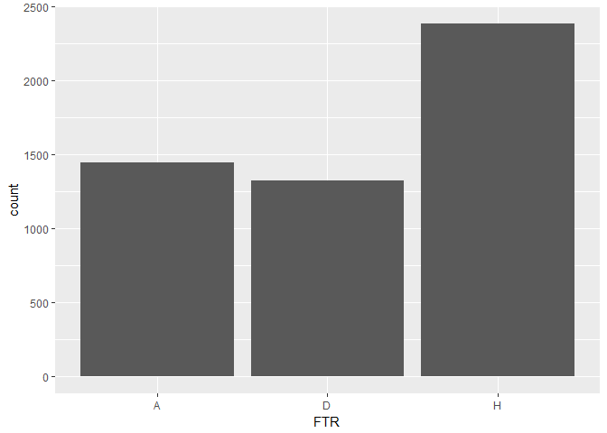
在上图中，可以清楚的看到，主场球队（H）的胜率远远高于客场球队（A）的胜率，而平手率（H）是最低的。这也符合了我们经常说的主场优势。而胜利的前提是要进足够多的球，那么我们再来看一下主客球的平均进球数。

*主场球队进球情况*

    ##    Min. 1st Qu.  Median    Mean 3rd Qu.    Max.
    ##   0.000   1.000   1.000   1.532   2.000   9.000

*客场球队进球情况*

    ##    Min. 1st Qu.  Median    Mean 3rd Qu.    Max.
    ##   0.000   0.000   1.000   1.129   2.000   6.000

主场球队的平均进球数高于客场球队0.403球，最大进球数也比客场球队多了3个球。下图的上半部分是主场球队进球数场次统计图，下半部分是客队进球数场次统计图。可以看出，主队进两球的比赛总数明显的多于客队进两球的比赛总数。

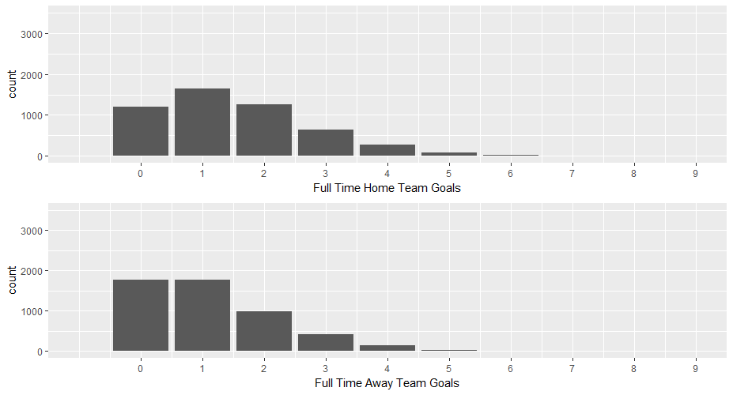

为什么有主场优势这么一个说法，为什么说主队会在比赛中更有信心呢？这些是源自于球队对比赛场地的熟悉程度和自家球迷的支持，而且前者比后者更为重要。主队球队的日常训练场地就是他们的主场比赛场地，所以常年累月下来，他们对环境更为熟悉，比客队更加清楚自己家的球门在哪里，自己家的草皮怎么样之类的，就像你知道你家门口包子铺的包子味道怎么样一样。因此，对于进攻队员来说，他们对自己家的球门更有方向感，所以会不会造成主队在射门比，甚至是命中率上超过客队呢？我们看一下数据：
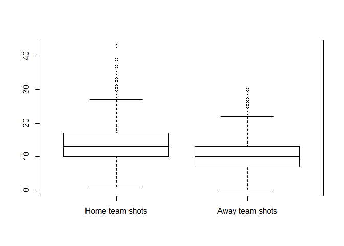
上图是主客队的射门箱图，可以清晰地看到，主队比客队的射门更为频繁，进攻欲望更为强烈，当然，这可能和现场主队的球迷也有关，毕竟谁都想在自己家拿下比赛，回馈球迷的期待。同样的，我们也可以看到，在球队的射正次数方面，主队也是优于客队。
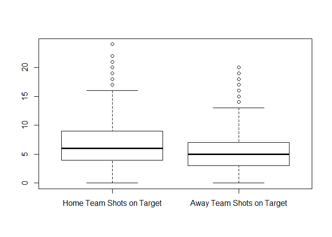
我们用射正次数除以射门次数，得到一个粗略的精准值，发现主队以0.4875对0.4790的微弱优势，证明了在2003年到2016年之间，主队的射门次数和准确率都要高于客队，可以说他们对自家的球门更有感觉。

## 球队之最
在2003赛季到2016赛季，一共有38支队伍出现在了英超赛场上，我们来看一下他们的表现。
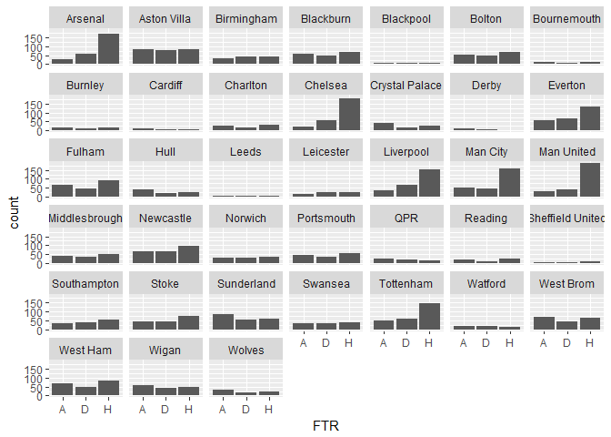
上面这张图代表的是每个队作为**主场球队**参加比赛的情况，柱状图从左到有分别为输（客队胜），和，胜（主队胜）的次数。
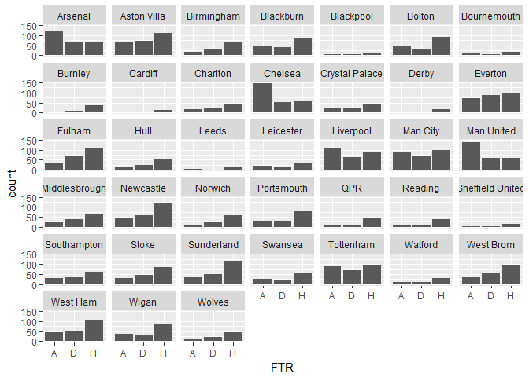
上面这张图则代表的是每个队作为**客场球队**参加比赛的情况，柱状图从左到有分别为胜（客队胜），和，输（主队胜）的次数。

我们再合起来统计几个有趣的榜单。
### 英超2003-2016最强主场？

    ##         team   win     n  win_rate
    ## 1 Man United   190   258 0.7364341
    ## 2    Chelsea   178   257 0.6926070
    ## 3    Arsenal   172   257 0.6692607
    ## 4   Man City   157   257 0.6108949
    ## 5  Liverpool   156   256 0.6093750
    ## 6  Tottenham   147   258 0.5697674

曼联是2003-2016赛季中主场胜率最高的球队，胜率高达73.6%，紧随其后的是切尔西和阿森纳。

### 英超2003-2016最差主场？
    ##        team   win     n   win_rate
    ## 1     Derby     1    19 0.05263158
    ## 2 Blackpool     5    19 0.26315789
    ## 3   Cardiff     5    19 0.26315789
    ## 4     Leeds     5    19 0.26315789
    ## 5       QPR    15    57 0.26315789
    ## 6   Watford    13    49 0.26530612
这项排名中，德比郡荣获第一，他们在仅有的19场主场比赛中，只赢下了一场比赛，第二三名分别是布莱克浦卡迪夫

### 英超2003-2016最强客场?
    ##         team   win     n  win_rate
    ## 1    Chelsea   146   258 0.5658915
    ## 2 Man United   138   257 0.5369650
    ## 3    Arsenal   125   258 0.4844961
    ## 4  Liverpool   106   259 0.4092664
    ## 5   Man City    92   258 0.3565891
    ## 6  Tottenham    90   257 0.3501946
切尔西在客场发挥最佳，胜率达到了56.6%，实在是不容易，紧随其后的是曼联和阿森纳。

### 英超2003-2016最差客场?
    ##      team   win     n   win_rate
    ## 1   Derby     0    19 0.00000000
    ## 2 Burnley     4    47 0.08510638
    ## 3 Cardiff     2    19 0.10526316
    ## 4  Wolves     9    76 0.11842105
    ## 5     QPR     7    57 0.12280702
    ## 6 Norwich    12    95 0.12631579
德比郡完成了双杀，他们在19场客场中一场未赢，也就是说，他们在仅有的一个英超赛季中，就拿下了一场比赛的胜利。非常的郁闷。伯恩利和卡迪夫紧随其后。

### 主客场胜率总分布图
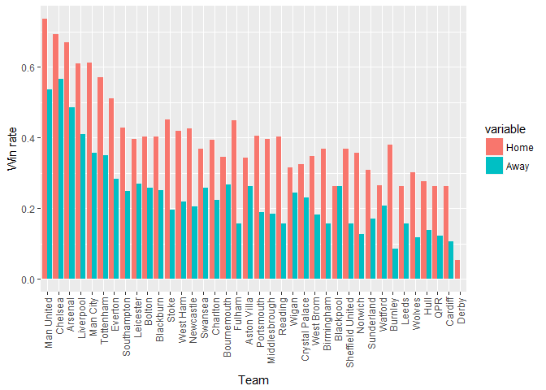

## 射正和胜率
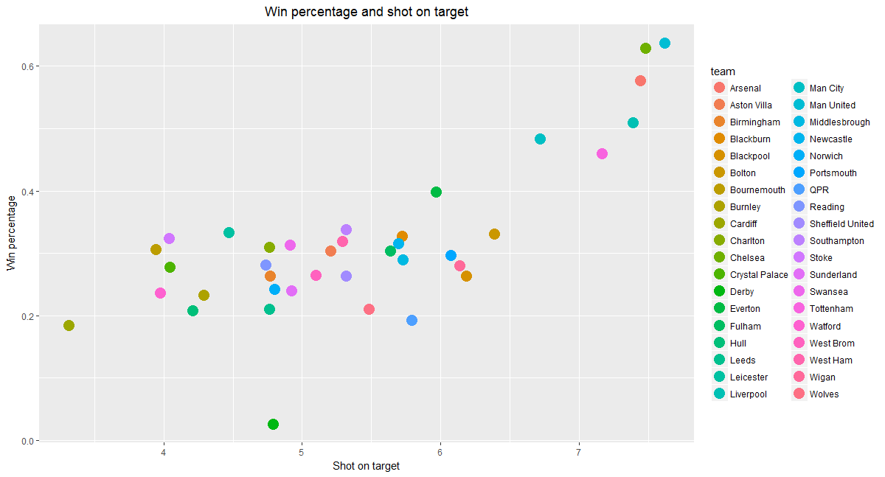
这张图的横坐标是射门命中门框范围内的次数，纵坐标是胜率。这个图形的趋势比较明显，也比较符合我们的理解，你射正的次数越多，越能转化为进球。所以一定要多射门，而且追求准星。每个球队用不同颜色的点在图中表示出来。阿森纳，曼城，切尔西在这里领跑。

### 最野蛮的球队
在我们的印象中，一个球队如果作风很凶悍，比如经常会用犯规作为一个战术，他们的胜率是不是相对来说比较高一点？为此，我统计了每个球队犯规数和胜率之间的关系。
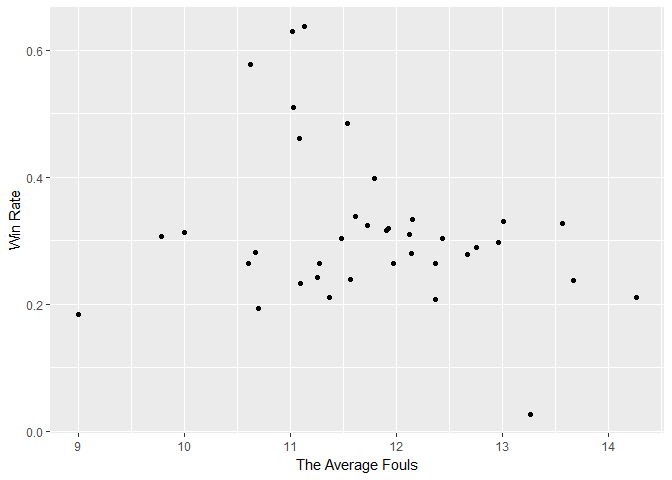
然而，从上图中我们可以看到，这两个变量不存在明显的相关性，相反犯规次数集中于中间的球队，他们的胜率看上去比较高。那我们只能这样来解释：因为犯规是最为避免对方进攻获利的一个手段，所以他是被迫的，犯规的次数越多，说明球队受到的压迫越多，所以场上的局面是对手较强。我们来看一下谁是英超最野蛮的球队吧。
    ##              team     foul
    ## 1           Leeds 14.26316
    ## 2         Watford 13.66433
    ## 3       Blackburn 13.56433
    ## 4           Derby 13.26316
    ## 5          Bolton 13.01170
利兹联成为了英超犯规最多的球队，他们以场均14次的犯规位居榜首，第二名是沃特福德。我们还可以看到德比郡也挤进了前五。

## 裁判对比赛有影响吗？
最近的2016/2017赛季，裁判的判罚引来了更大的争议，甚至有英超四瞎这种戏称。我们来看看不同裁判是不是对比赛有不同影响。
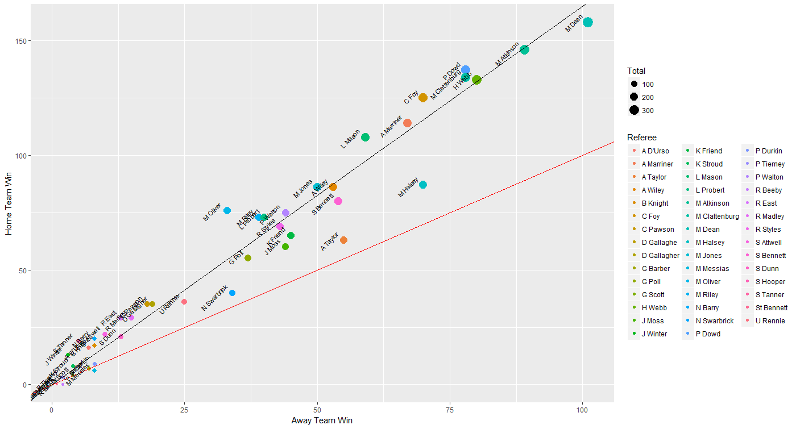
这张图反映了在不同裁判的执法下，主队和客队的胜利场次，黑色斜线表示的是平均胜率比，红色斜线是斜率为1的情况（主客场胜利场次相等）。我们可以看到大多数裁判执法下，主场胜数高于客场胜数，这主要是受到我们之前说到的主场优势影响。而这里强调的是，的确不同的裁判对主客场的胜率比不一样。比如Talyor和Halsey这两位裁判，远远偏离了平均线，这不免让我们想象，他们对客场有特殊的偏好。如果你支持的球队遇上这个裁判，可要当心咯！

我也对每个裁判的出牌数量做了统计，因为部分裁判执法比赛数较少，我选取了中位数，即执法39场，统计了超过39场裁判的场均出牌数，结果如下：
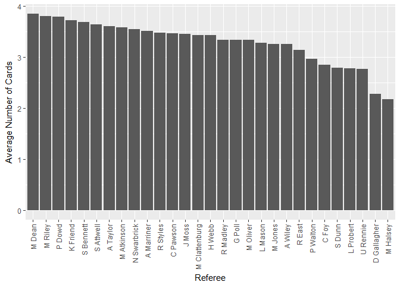
结果非常棒，因为2003-2016赛季最爱出牌的是麦克迪恩！这哥们最近因为乱出红牌被下放到了英冠比赛，好像最近在英冠比赛中，也乱吹了一个很有争议的球。如果你的主队遇上这几个裁判，可得小心了，球员们应该也要注意自己的脚下动作，避免不必要的吃牌。毕竟裁判发起疯来不好惹！

## 其他探索
### 英超2013-2016每场比赛进球数分布图
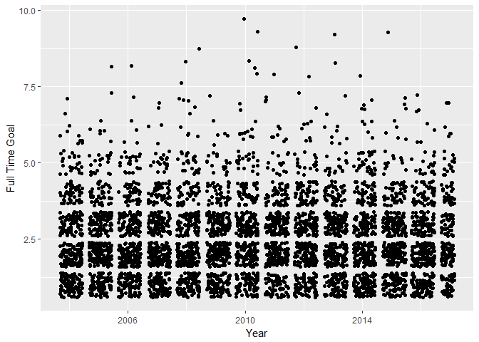

### 英超2013-2016每场比赛进球数与射门数关系图
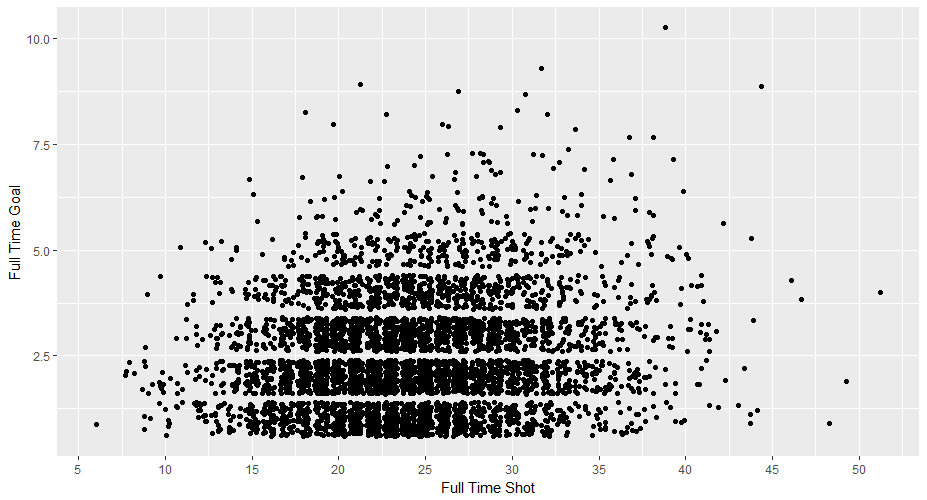

# 总结
以上就是我对英超比赛数据的一些探索。其实还有很多好玩的比赛数据值得研究，比如阵型，控球率之类的，但由于数据的匮乏，我只能在表面稍微挖掘一点，希望以后有机会能够对英超比赛数据有个更深入的了解。
